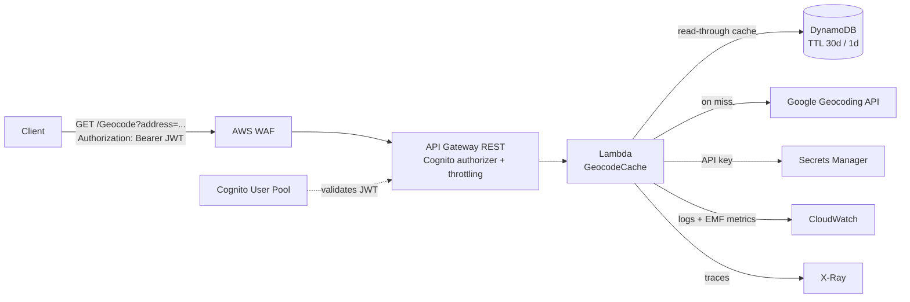

# Architecture

## Overview



Request path: **WAF → API Gateway (JWT auth + throttle) → Lambda → DynamoDB (hit) or Google (miss)**.
The full Google response is cached for 30 days (1 day for `ZERO_RESULTS`) and returned verbatim.

## Layered design (Clean Architecture)

```
Lambda  ─────────────┐
                     ├──► Application ──► Domain   (Domain has zero AWS/3rd-party deps)
Infrastructure ──────┘            ▲
        └──────────── implements ─┘ (ports: IGeocodeCache, IGeocodingProvider, IGoogleApiKeyProvider, IClock)
```

- **Domain** — entities (`CachedGeocode`, `GeocodeOutcome`), ports, `AddressKey` normalization. Pure.
- **Application** — `GeocodeService` (the read-through cache policy) + validated options.
- **Infrastructure** — DynamoDB, Google (typed `HttpClient` + Polly), Secrets Manager, system clock.
- **Lambda** — composition root: raw `APIGatewayProxyRequest` handler, DI, logging, metrics, tracing.

Dependencies point inward; the Domain is testable with no mocks of AWS. Adapters are swappable.

## Request flow

1. `GeocodeFunction.FunctionHandlerAsync` (warm-reused DI container) opens a scope → `GeocodeRequestHandler`.
2. Handler validates `address` (400 if missing/blank) and calls `GeocodeService`.
3. Service normalizes the address → cache key, reads DynamoDB.
4. **Hit** (`ExpiresAt > now`) → return cached JSON, `X-Cache: HIT`.
5. **Miss/expired** → call Google, apply the caching policy, write DynamoDB, return `X-Cache: MISS`.
6. Handler maps failures: `ArgumentException`→400, `GeocodingProviderException`→502, anything else→500,
   all as a consistent `{ "error", "message" }` envelope. EMF metrics + structured logs are emitted.

## Caching policy

| Google status | Cached? | TTL | HTTP |
| --- | --- | --- | --- |
| `OK` | yes | `Cache:TtlDays` (30) | 200 |
| `ZERO_RESULTS` | yes (negative) | `Cache:NegativeTtlDays` (1) | 200 |
| `OVER_QUERY_LIMIT`, `REQUEST_DENIED`, `INVALID_REQUEST`, `UNKNOWN_ERROR` | **no** | — | 200/forwarded |
| transport/network failure | n/a | — | 502 |

**Why expiry is checked in code, not only via DynamoDB TTL:** DynamoDB TTL deletion can lag up to ~48h,
so relying on it alone could serve stale data past 30 days. The service treats `ExpiresAt <= now` as a
miss; TTL is used only for cost-saving cleanup. This guarantees "after 30 days, call Google regardless."

## Data model (DynamoDB)

Partition key `AddressKey` (normalized: trim → collapse whitespace → lower-case).

| Attribute | Type | Notes |
| --- | --- | --- |
| `AddressKey` | S | PK |
| `OriginalAddress` | S | first caller's raw text |
| `GoogleResponse` | S | full Google JSON (returned verbatim) |
| `GoogleStatus` | S | `OK` / `ZERO_RESULTS` / ... |
| `IsNegative` | BOOL | true for `ZERO_RESULTS` |
| `CachedAtUtc` | S | ISO-8601 |
| `ExpiresAt` | N | epoch seconds — **DynamoDB TTL attribute** |

On-demand billing, SSE-KMS (customer-managed key), point-in-time recovery. Writes use a conditional
expression (`attribute_not_exists OR ExpiresAt < :new`) as a **cache-stampede guard**.

## Security

- **Auth**: Cognito User Pool JWT authorizer on the API Gateway method.
- **Edge**: AWS WAF (per-IP rate limit + AWS managed common / known-bad-inputs rule sets).
- **Throttling**: stage rate/burst limits protect the backend and the Google quota.
- **Secrets**: Google key in Secrets Manager (cached at runtime), env-var fallback for local. Never in
  source, config, logs, or Terraform state (Terraform creates the empty secret; the value is set out-of-band).
- **Least privilege IAM**: DynamoDB CRUD on the one table, `GetSecretValue` on the one secret, KMS decrypt,
  CloudWatch Logs, X-Ray. CI deploys via GitHub OIDC (no static keys).
- **Encryption**: KMS at rest (table, secret, log group); TLS in transit.

## Observability

- **Logs**: structured JSON to CloudWatch (cache hit/miss, address key, Google status, latency; never the key).
- **Metrics**: EMF custom metrics (`GeocodeCache` namespace — `Requests` by `CacheResult`, `Latency`).
- **Tracing**: X-Ray active tracing; AWS SDK calls instrumented in-process when running in Lambda.
- **Alarms + dashboard**: Lambda errors/throttles, API 5XX; dashboard for invocations, duration p95,
  cache hit/miss, and API latency.

## Infrastructure (Terraform)

`infra/terraform` (one `apply` stands up everything) with modules: `dynamodb`, `iam`, `lambda`,
`apigateway`, `cognito`, `waf`, `monitoring`. `infra/bootstrap` is a one-time root that creates the
GitHub OIDC provider + deploy role for CI.

## Production hardening roadmap

- **API access/execution logging** via an account-level CloudWatch role (`aws_api_gateway_account`).
- **Provisioned concurrency** for cold-start SLAs (variable exists, default 0 to avoid free-tier cost).
- **Full request coalescing** (single-flight lease) beyond the current conditional-write guard.
- **Secret rotation** for the Google key (Secrets Manager rotation Lambda).
- **Multi-region / DR**: DynamoDB global tables + regional API + Route 53 failover.
- **WAF tuning**: per-rule counting → blocking, custom rules, bot control.
- **Blue/green deploys** via Lambda alias traffic shifting + CodeDeploy.
- **Alarming destinations**: wire `alarm_sns_topic_arn` to SNS/PagerDuty.
